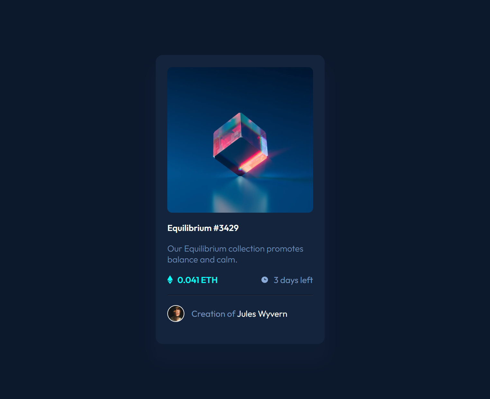
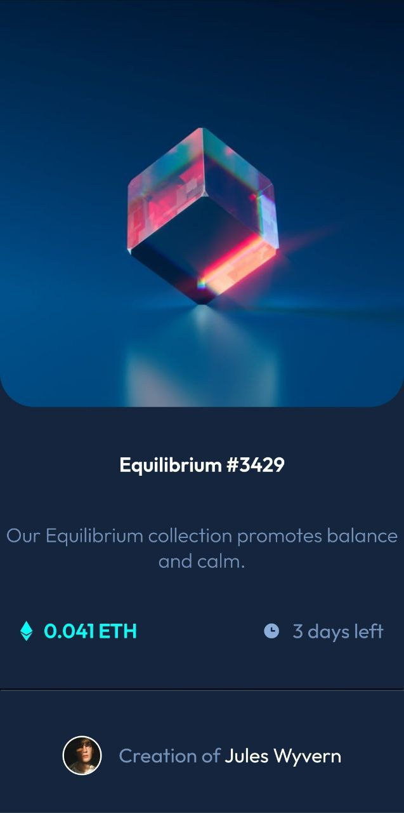

# 😶‍🌫️ NFT Preview Card - Page Solution

This is my first solution to the [NFT Preview Card challenge on Frontend Mentor](https://www.frontendmentor.io/challenges/nft-preview-card-component-SbdUL_w0U/hub) and took me 6 hours to complete. Frontend Mentor challenges help you improve your coding skills by building realistic projects. If you are a beginner you really need to try this!

## 🪞 Screenshots

## 🎥 Live WebSite

- [Live site URL](https://alexandru-ghergu.github.io/social-proof-section-master/)

## 🪄 Technologies

- `HTML5`
- `CSS`
- `Flexbox`

## 🎢 What I learned

- How to use ::before and ::after Pseudo Elements
- How to get Pixel Perfect project without using Figma.
